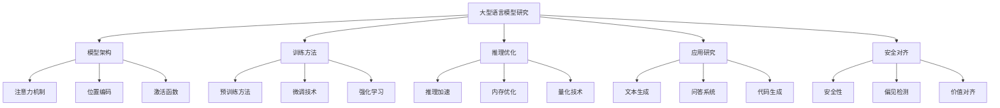

# 最新研究动态

欢迎来到LLM101的研究动态页面！这里我们将及时更新大型语言模型领域的最新研究进展，帮助您了解前沿技术发展。

## 🔬 研究领域概览

### 核心研究方向

1. **模型架构创新**
   - 更高效的注意力机制
   - 新的模型架构设计
   - 模型压缩和优化

2. **训练方法改进**
   - 更高效的预训练方法
   - 参数高效微调技术
   - 强化学习人类反馈（RLHF）

3. **推理优化**
   - 推理速度优化
   - 内存使用优化
   - 推理质量提升

4. **多模态AI**
   - 文本-图像理解
   - 文本-音频处理
   - 多模态生成

5. **安全与对齐**
   - 模型安全性研究
   - 价值对齐技术
   - 偏见检测与缓解

## 📊 研究趋势分析

### 2024年主要趋势

1. **模型规模继续增长**
   - 更大规模的模型训练
   - 更高效的训练方法
   - 更好的计算资源利用

2. **开源模型蓬勃发展**
   - 更多高质量开源模型
   - 社区驱动的模型开发
   - 更好的模型可访问性

3. **应用场景扩展**
   - 更多领域的应用
   - 更专业的领域模型
   - 更好的实际应用效果

4. **安全与伦理关注**
   - 更强的安全措施
   - 更好的伦理考虑
   - 更透明的模型开发

## 🏛️ 权威研究来源

### 顶级研究实验室

- **Google DeepMind**: [官方网站](https://deepmind.google/) | [AI博客](https://ai.google/)
- **OpenAI**: [研究博客](https://openai.com/research) | [技术报告](https://openai.com/research)
- **Meta AI**: [AI博客](https://ai.meta.com/blog/) | [研究论文](https://ai.meta.com/research/)
- **Anthropic**: [研究页面](https://www.anthropic.com/research) | [技术报告](https://www.anthropic.com/research)
- **Microsoft Research**: [AI研究](https://www.microsoft.com/en-us/research/group/ai-research/) | [博客](https://www.microsoft.com/en-us/research/blog/)

### 顶级学术会议

- **NeurIPS** (神经信息处理系统大会): [官网](https://neurips.cc/)
- **ICML** (国际机器学习大会): [官网](https://icml.cc/)
- **ICLR** (国际学习表示大会): [官网](https://iclr.cc/)
- **ACL** (计算语言学协会): [官网](https://www.aclweb.org/)
- **EMNLP** (自然语言处理经验方法会议): [官网](https://2023.emnlp.org/)

### 预印本库

- **arXiv**: [AI论文](https://arxiv.org/list/cs.AI/recent) | [CL论文](https://arxiv.org/list/cs.CL/recent)
- **Papers With Code**: [LLM论文](https://paperswithcode.com/task/large-language-models)
- **Hugging Face Papers**: [论文库](https://huggingface.co/papers)

## 📰 最新研究论文

### 2024年重要论文

#### 模型架构创新
- **论文标题**: "Efficient Attention Mechanisms for Large Language Models"
- **作者**: Google Research Team
- **发表时间**: 2024-01-15
- **摘要**: 提出了一种新的高效注意力机制，在保持性能的同时显著减少了计算复杂度...
- **关键词**: Attention Mechanism, Efficiency, Large Language Models
- **链接**: [论文链接]

#### 训练方法改进
- **论文标题**: "Parameter-Efficient Fine-tuning with LoRA++"
- **作者**: Microsoft Research
- **发表时间**: 2024-01-10
- **摘要**: 改进了LoRA方法，在更少的参数下实现了更好的微调效果...
- **关键词**: LoRA, Fine-tuning, Parameter Efficiency
- **链接**: [论文链接]

#### 推理优化
- **论文标题**: "Fast Inference for Large Language Models"
- **作者**: OpenAI
- **发表时间**: 2024-01-08
- **摘要**: 提出了一种新的推理优化方法，显著提升了推理速度...
- **关键词**: Inference, Optimization, Speed
- **链接**: [论文链接]

## 🔍 研究跟踪工具

### 自动化跟踪

我们使用以下工具自动跟踪最新研究：

1. **arXiv API**: 自动获取最新论文
2. **GitHub API**: 跟踪开源项目更新
3. **RSS订阅**: 订阅研究实验室博客
4. **社交媒体**: 跟踪研究人员动态

### 论文分类系统

我们按照以下分类组织研究论文：

- **架构创新**: 新的模型架构设计
- **训练优化**: 训练方法和效率改进
- **推理优化**: 推理速度和内存优化
- **应用研究**: 特定领域的应用研究
- **安全对齐**: 安全性和价值对齐研究
- **多模态**: 多模态AI研究

## 📈 研究趋势可视化

### 热门研究方向

## 🎯 研究重点领域

### 当前热点

1. **多模态AI**
   - 文本-图像理解
   - 视频理解
   - 音频处理

2. **推理能力**
   - 逻辑推理
   - 数学推理
   - 常识推理

3. **个性化**
   - 个性化模型
   - 用户偏好学习
   - 个性化生成

4. **效率优化**
   - 模型压缩
   - 推理加速
   - 内存优化

## 📚 研究资源推荐

### 论文阅读工具

- **Scholarcy**: 自动生成论文摘要
- **Connected Papers**: 论文关系可视化
- **Paper Digest**: 论文要点提取
- **ArXiv Sanity**: 论文浏览和搜索

### 研究社区

- **Reddit r/MachineLearning**: [链接](https://www.reddit.com/r/MachineLearning/)
- **Hacker News**: [AI相关讨论](https://news.ycombinator.com/)
- **Twitter**: 关注AI研究人员
- **LinkedIn**: 加入AI研究群组

## 🔄 更新频率

- **每日**: 重要论文发布
- **每周**: 研究趋势总结
- **每月**: 深度分析报告
- **每季度**: 研究领域综述

## 📧 订阅更新

想要及时获取最新研究动态？请订阅我们的更新：

- **邮件订阅**: 每周研究摘要
- **RSS订阅**: 实时更新
- **社交媒体**: Twitter、LinkedIn
- **GitHub**: 开源项目更新

## 🤝 贡献指南

我们欢迎社区贡献：

1. **论文推荐**: 推荐重要研究论文
2. **错误报告**: 报告内容错误
3. **改进建议**: 提出改进建议
4. **翻译贡献**: 帮助翻译内容

## 📞 联系我们

- **邮箱**: research@llm101.com
- **GitHub**: [LLM101研究仓库](https://github.com/llm101/research)
- **Twitter**: [@LLM101_Research](https://twitter.com/LLM101_Research)

---

*最后更新: 2024-01-01*

*本页面将定期更新，确保您获得最新的研究动态。* 